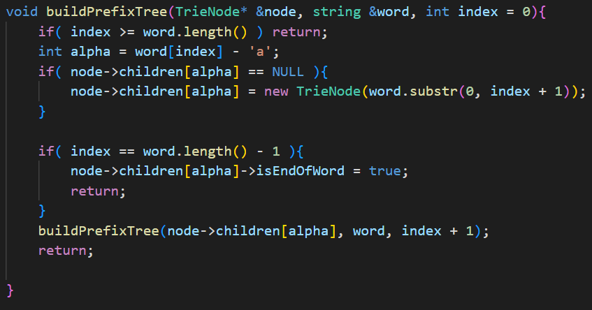
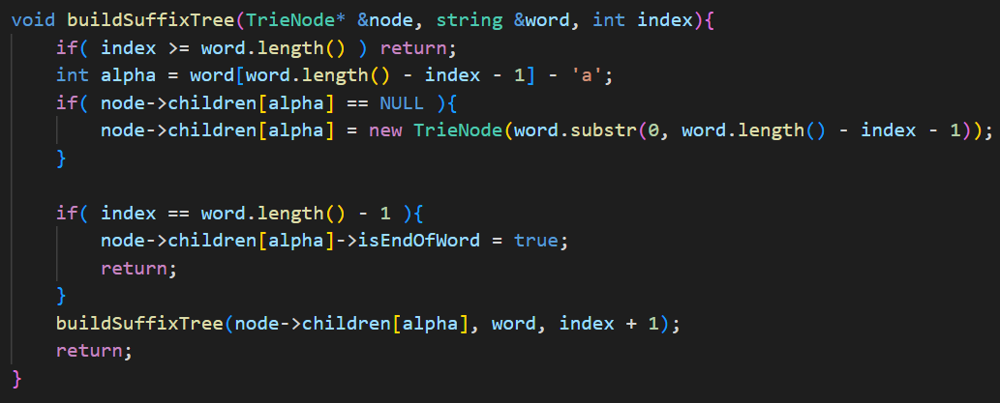
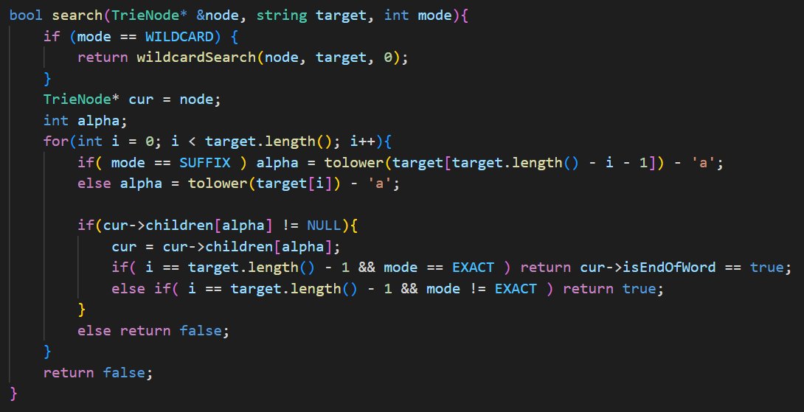
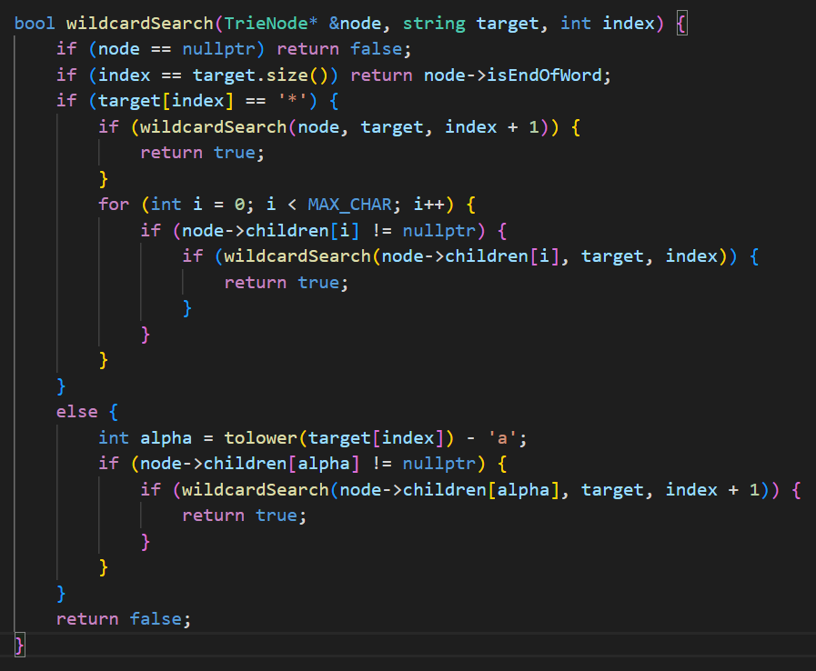

# Essay Search

## Intro

This project implements a search functionality using Trie data structure as the core component. The implementation is detailed in `main.hpp`, where a class `Tree` is defined, encompassing two TrieNode instances - one for Prefix Search, Exact Search, and Wildcard Search, and the other for Suffix Search.

## Trie Structure

Tries are built for both prefixes and suffixes:

### Prefix Trie
- Begins from the start of the word.
- Iterates through each character.
- Checks for the existence of a corresponding TrieNode in the current children nodes.
- Creates a new TrieNode if it doesn't exist.
- Marks the last TrieNode as the end of the word (`isEndOfWord`).

### Suffix Trie
- Similar to the Prefix Trie but starts from the end of the word.
- Follows the same method for checking and creating TrieNodes.
- Marks the last TrieNode as the end of the word upon reaching the start of the word.

## Search Functionality

Supports Exact, Prefix, Suffix, and Wildcard searches.

- **Exact and Prefix Search**: Uses Prefix Tree. Exact search requires the `isEndWord` flag.
- **Suffix Search**: Utilizes the Suffix Tree.
- **Wildcard Search**: Implemented using recursion to traverse the Trie. It considers all possible paths for the '*' character, representing zero or more characters.

## Main Process

In `main.cpp`, the process is divided into three main steps:

1. **Read Data**: Reads files, builds both Prefix and Suffix Trees for titles and contents, and stores them in `data_list`.
2. **Read Query File**: Processes the query file and decides the type of search based on commands.
3. **Write Output**

## Optimization Techniques

- **Efficiency Enhancements**: Use of pointers in function parameters and `emplace_back()` instead of `push_back()` in vectors.
- **isResult Tracking**: Initially, each result was stored and processed using intersection and difference operations. Now, `isResult` in the `Data` class tracks this, simplifying the process.

## Challenges and Conclusions

Initially, the combination of Trie and Suffix Tree was used for optimal performance. However, this approach was memory-intensive and impractical. After several attempts at optimization, the solution shifted to solely using Trie for feasibility.

## References and Inspiration

This project was inspired and informed by various sources:

- [Wildcard Trie Implementation by Teodor Dyakov](https://github.com/TeodorDyakov/wildcard-trie/tree/master)
- [Trie Data Structure Explanation on CSDN](https://blog.csdn.net/v_july_v/article/details/6897097)
- [Advanced Trie Usage on CSDN](https://blog.csdn.net/fjsd155/article/details/80211145)

